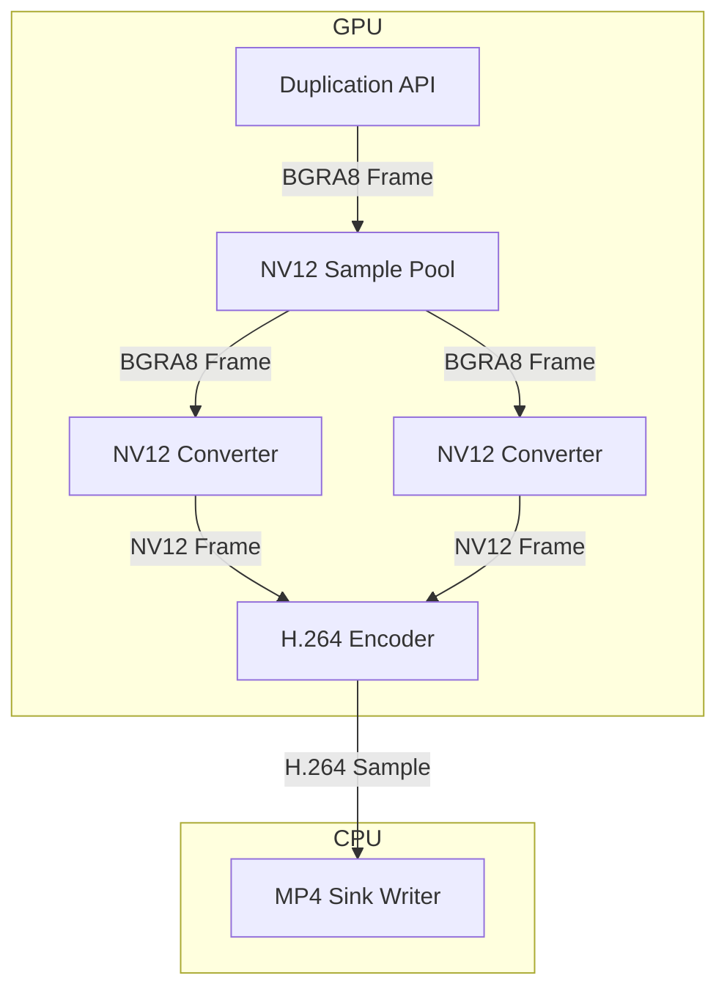

# cappls

`cappls` is a zero-copy screen capture program. It records the screen and writes video to
an mp4 file. Frames remain on the GPU until they are ready to be written to the mp4 file.

## Usage

```cmd
cappls.exe video.mp4
```

This starts `cappls` with default arguments (target FPS, bitrate, etc.). To start recording,
press `CTRL` + `SHIFT` + `.`. To stop recording, press `CTRL` + `SHIFT` + `.` again.
`cappls` does not have to be in focus to intercept `CTRL` + `SHIFT` + `.`.
The recorded video will be written to the given file (in this case, `video.mp4`).

```cmd
cappls.exe --help
```

Pass the `--help` option to get a list of options and arguments. Arguments are set with
`=`, like `--fps=50`.

## Architecture



At every tick, the D3D Duplication API is used to capture the target display
as a BGRA8 texture. H.264 encoders typically expect NV12 samples as input, so
the BGRA8 texture is fed into a pool of BGRA8 -> NV12 converters.
The first available converter is chosen, and the BGRA8 texture is converted to NV12
with the D3D Video Processor API. At this point, an `IMFSample` is created with the current frame's timestamp and duration, and the converter is marked as in-use.

The H.264 encoder is asynchronous. NV12 samples are queued and H.264 samples are received
on the main thread, but encoding is done asynchronously. The NV12 sample from the chosen
converter is sent to the encoder. The converter remains in-use until the corresponding
H.264 sample is received. Finally, the H.264 sample is sent to an MP4 sink writer, which
writes the sample to an MP4 file.

### NV12 Converter Pool

While we're waiting for the encoder to spit out an H.264 sample, we can start
processing the next frame (if the target FPS is high enough, of course). We can't
reuse NV12 samples until the encoder is done with them, so we use a pool of NV12
converters and samples. We use a pool of converters instead of a pool of samples to
avoid copying from a single converter's output to a pool sample.

### TODOS

- Test again with NVEnc
- Include the cursor in duplicated frames
- Support for capture on one GPU and encoding on another
- Get DXGI adapter BEFORE auto-selecting encoder
- Ability to differentiate two encoders with the same class ID
- Timing for pipeline stages
- Option to set keyframe interval
